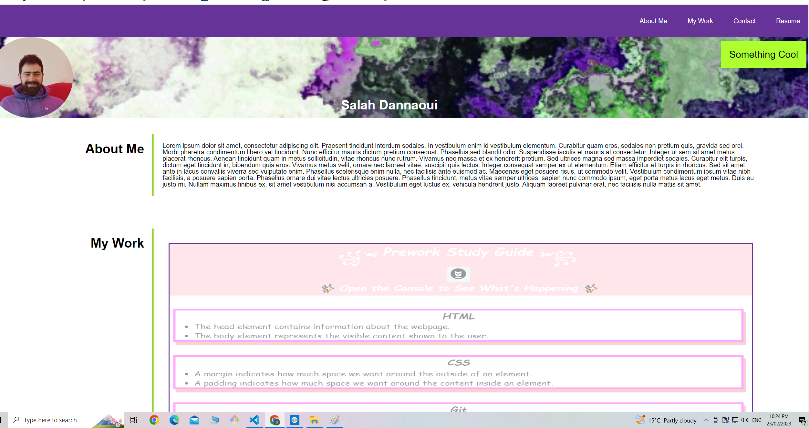
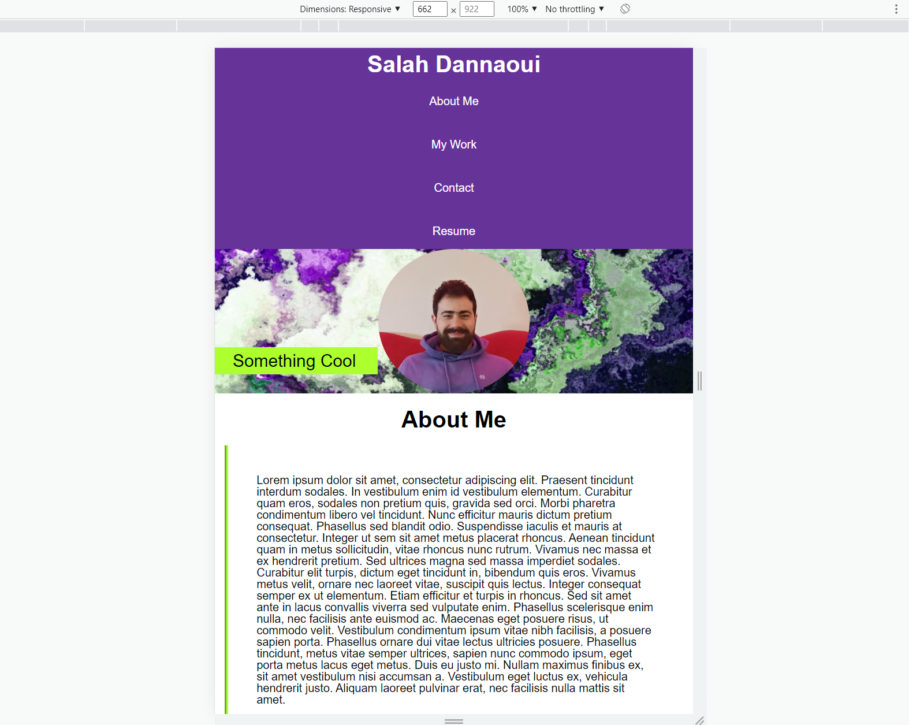

# Portfolio Website

## I made this page to display all the things i have learned and will continue to learn on my journey in programming.
It allows me to have all my best work and most recent accomplishments on display.
it has also allowed me to hone in on my html and CSS skills.

## Installation

N/A

## Usage

The nav bar allows you to scroll immediately to the selected items.

The 'my work' section items also, when clicked, take you to the linked pages.

The contact items are also linked to allow direct access to the contact info.

finally the display is responsive and accommodates different device resolutions.

Provide instructions and examples for use. Include screenshots as needed.

## License

MIT License

Copyright (c) 2023 salahdannaoui

Permission is hereby granted, free of charge, to any person obtaining a copy
of this software and associated documentation files (the "Software"), to deal
in the Software without restriction, including without limitation the rights
to use, copy, modify, merge, publish, distribute, sublicense, and/or sell
copies of the Software, and to permit persons to whom the Software is
furnished to do so, subject to the following conditions:

The above copyright notice and this permission notice shall be included in all
copies or substantial portions of the Software.

THE SOFTWARE IS PROVIDED "AS IS", WITHOUT WARRANTY OF ANY KIND, EXPRESS OR
IMPLIED, INCLUDING BUT NOT LIMITED TO THE WARRANTIES OF MERCHANTABILITY,
FITNESS FOR A PARTICULAR PURPOSE AND NONINFRINGEMENT. IN NO EVENT SHALL THE
AUTHORS OR COPYRIGHT HOLDERS BE LIABLE FOR ANY CLAIM, DAMAGES OR OTHER
LIABILITY, WHETHER IN AN ACTION OF CONTRACT, TORT OR OTHERWISE, ARISING FROM,
OUT OF OR IN CONNECTION WITH THE SOFTWARE OR THE USE OR OTHER DEALINGS IN THE
SOFTWARE.

